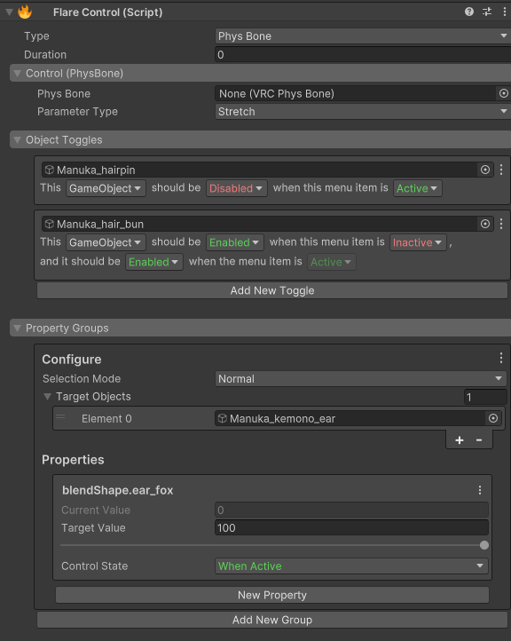
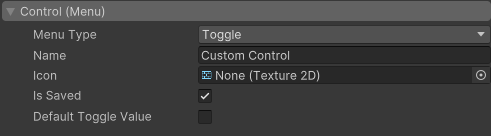
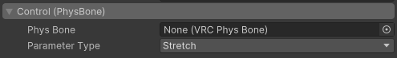
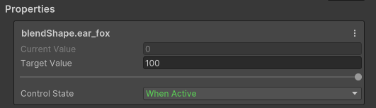

import ReactPlayer from "react-player";

# Flare Control

The Flare Control is the heart of this tool. There are multiple parts to it, but once they're understood
the component becomes trivial to work with.

## Anatomy
Each FlareControl has a parameter that drives it, and it can be represented as a value of 0 to 1.
When "the control" is at 0, it is inactive. When the control is at 1, it is active. For Radials,
PhysBones, and Contacts, that value can be somewhere in between.

Every control has section for the selected control type, object toggles, and property groups. You can learn
more about each one of those below.

## Stateful
This is important. When working with Flare Controls, you will see two words highlighted in green and red
respectively, "Active" and "Inactive". For every toggle or property you setup, there will be one Active/Inactive
value you can change. The opposite of that state how your avatar is **currently** in the editor.

As an example, you can have a toggle that disables an object when it is `Inactive`. Let's say this object is the
avatar's shirt. In the editor, it's enabled. Flare will interpret the object being disabled when it's `Inactive` and
the object being enabled when it's `Active`. You can override this to be a value you pick if you don't want to rely
on the editor state for your controls.

## Type
The type of the control. This determines how the control is represented on the avatar.
* **Menu** - Creates a (synced) menu item.
* **PhysBone** - Drive a control using a PhysBone parameter. 
  This includes Stretch, Squish, IsPosed, IsGrabbed, and Angle
* **Contact** - Drive a control using a contact receiver.

## Duration
Interpolate your control. This value is in seconds. The control will take (duration) long to go from
0 to 1 (False to True) and vice versa. You can use this to create smooth transitions, simple dissolve
effects, and gradual activations.

## Controls
There are multiple control types.

### Menu Item
This will be the control you use most often (most likely). It creates a menu control on your avatar which
you can control in game.
* `Menu Type` - The type of the menu item.
  * `Toggle` - A simple toggle. Turns on and off.
  * `Radial` - A radial that goes from 0 to 1.
  * `Button` - A button which is only turned on when pressed.
* `Name` - The name of the menu (and parameters).
* `Icon` - The icon used in the menu.
* `Is Saved` - Is the state of this control persisted through world changes, avatar changes, and avatar resets?
* `Default Value` (Toggle and Radial) - The default value of the control.

### PhysBone
Allows you to drive the control's value with a PhysBone parameter.
* `Phys Bone` - The PhysBone to get parameters from.
  * If this PhysBone already has a parameter assigned to it, Flare will use that instead of generating its own.
* `Parameter Type` - The parameter to drive the control with.
  * `Stretch`
  * `Squished`
  * `Is Grabbed`
  * `Is Posed`
  * `Angle`

### Contact
Allows you to drive the control's value with a Contact Receiver.
* `Contact Receiver` - The Contact Receiver to use.
    * If this Contact Receiver already has a parameter assigned to it, Flare will use that instead of generating its own.

## Object Toggles
Toggles let you set the activity of a GameObject, Behaviour, or a Renderer. It is called the `Target`.

When dragging in an object as the `Target` when there was nothing there before while the `Type` of the control
is of `Menu` and the `Menu Type` is a toggle, Flare will try to predict the settings you want.
It uses the Default Toggle Value and compare it with the current activity state of the `Target` within the editor.

If your Default Toggle Value is `ON` (when your menu is `Active`) and you drag in a GameObject that is enabled,
it will configure the toggle to be disabled when the menu is `Inactive`. You can manually configure the toggle state
to follow the exact condition.

Each toggle follows a simple sentence structure: `This [Target] should be [Enabled / Disabled]
when the menu item is [Active / Inactive]`. If you're unsure on what a toggle does, just read it out loud
until it makes sense.

Each toggle uses the Editor state for the "opposite/default" value. If you want to override this behaviour,
you can enable `Override Default Value` in the context menu of the toggle.

Find more examples on the [examples page](/vrchat/flare/examples).

## Property Groups
Property groups allow you to control any animatable properties on the avatar (Materials, Blendshapes, PhysBones, 
most component properties). Properties are put into groups which determine how its animated.

### Groups
* `Selection Mode`
  * Normal - Directly select individual properties from the included GameObjects.
  * Avatar - Searches the entire avatar for properties to animate and will apply those properties to every matching
    property.
* `Target Objects`
  * When in `Normal` mode, the objects provided in here are used entirely for searching and selecting the properties
  * provided.
* `Objects To Exclude`
  * When in `Avatar` mode, the property animator will skip these over the objects provided.

### Property

Properties in Flare support booleans, integers, floats, vectors, and colors.

<ReactPlayer controls url={'/video/flare/property-group-selector.mp4'} />

* `Current Value` (Readonly) - The current value of the property Editor. This is also the value of the **opposite** of
    the control state.
* `Target Value` - The value you want the property to when the `Control State` is set to.
* `Control State` - Determines which value the property will be depending on the state of the control.
  * If it is `When Active`, when the control is `Active` (or 1), the selected property will be
    set to `Target Value`, and when the control is `Inactive` (or 0), the selected property
    will be set to the `Current Value`.

If you don't want to use the `Current Value` (the Editor value) as the opposite/default value,
you can enable `Override Default Value` in the context menu for each property.

That's it (for now)! Check out the examples over on the [examples page](/vrchat/flare/examples). to see some of the things you can make.