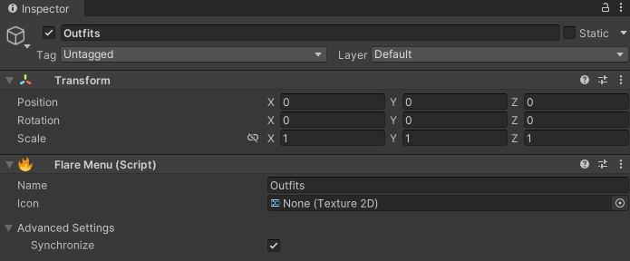

# Flare Menu

Flare Menus can be used to group menu controls. This grouping is reflected in the
[VRChat Expressions Menu](https://creators.vrchat.com/avatars/expression-menu-and-controls/).

Any FlareControl or FlareMenu placed as a child of the GameObject will be put into the parent
menu as a button, toggle, radial, or submenu.

# Name
The name of the menu. This is used to resolve the path of the submenu as well as to name the menu.

# Icon
The icon used for the expression submenu.

# Advanced Settings
* Synchronize - Control whether the menu name is tied to the GameObject name