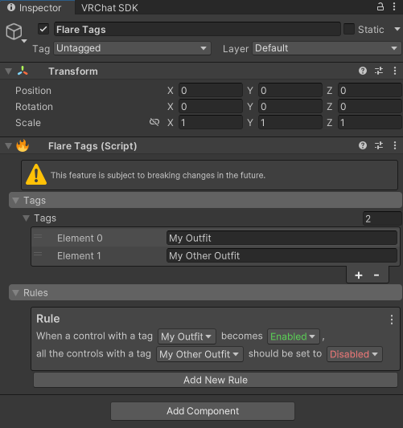

# Flare Tags

:::danger
Flare Tags are currently an experimental feature. They're subject to change,
and they have a few quirks, but they still work.
:::

The tag system allows you to trigger rules when a control with a layer is activated or deactivated.

You can attach any amount of tags to a `FlareControl`, and write rules using the following pattern:

```
When a control with a tag [TAG] becomes [Active / Inactive], all thecontrols with a tag [TAG] should be set to [Active / Inactive]
```

You can add as many rules as possible.

:::warning
You can TOTALLY make recursive rules. I don't recommend you do so (idk what'll happen)
:::


