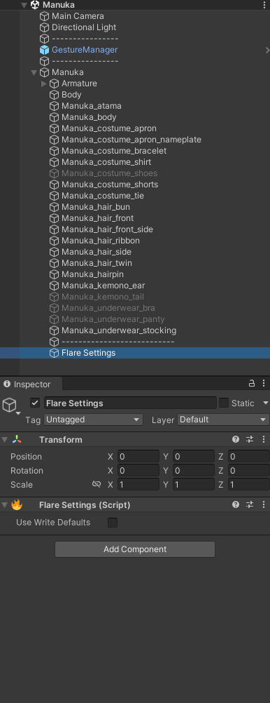

# Other

## Settings

You can add a `FlareSettings` component somewhere in your avatar to configure one (1) setting.

### Use Write Defaults

Allows you to customize the write defaults mode used by Flare
animator states (primarily for the tag system and controls with durations).

By default, without the component, it is set to `False`.